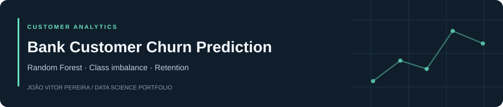

[English](README.md) · **Português** · [Portfólio](https://github.com/joaovspereira)

# Bank Customer Churn Prediction

## Objetivo

Previsão de saída de clientes com Random Forest e tratamento do desequilíbrio entre classes.

## Resultados

F1 de teste: **0,6141**; ROC-AUC: **0,8575**. Modelo selecionado: Random Forest com superamostragem, 200 árvores e profundidade máxima 15. A meta de F1 ≥ 0,59 foi atingida.

## Tecnologias

Python · pandas · NumPy · scikit-learn · Matplotlib

## Navegação e execução

- [Notebook em português](notebooks/bank_customer_churn_prediction.ipynb)
- [Dados necessários](data/README.md)
- [Instalação e execução](README.md#run-locally)
- [Revisão técnica e rastreabilidade](VALIDATION.md)

## Limites da análise

Métricas da execução original. Divisão aleatória sem estratificação; categorias de one-hot encoding determinadas antes da divisão. Não houve medição de aumento de retenção. F1 e ROC-AUC não são diretamente comparáveis.

A revisão de publicação verificou estrutura e sintaxe. O treinamento/análise completo não foi reexecutado com os datasets originais nesta revisão. Projeto educacional da TripleTen; não representa implantação em produção ou impacto financeiro realizado.

[João Vitor Pereira](https://github.com/joaovspereira) · [LinkedIn](https://www.linkedin.com/in/joao-vitor-de-souza-pereira)
